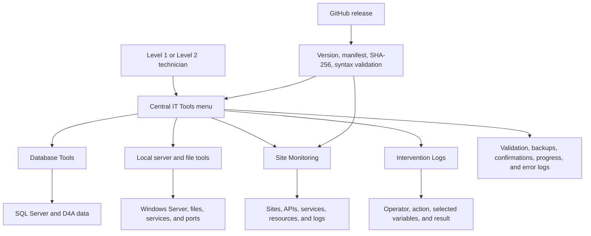

# Project Overview

## Executive summary

The D4A IT Automation and Operations Toolkit is a centralized Windows PowerShell solution for recurring database, server, troubleshooting, and monitoring work in Decide4Action environments. It turns procedures that once depended on manually assembled SQL commands, separate scripts, and technician memory into guided workflows with validation, progress reporting, logs, backups, and rollback options.

The project also serves a team-development objective. After my promotion to Level 2 Support, my manager wanted to delegate as many appropriate operations as possible to Level 1 Support while keeping the process simple and safe. I applied project-management and continuous-improvement methods to identify recurring work, standardize it, introduce safeguards, and package it in an interface that Level 1 technicians can follow with a lower margin for error.

The toolkit is designed to scale as new support cases are discovered. Its GitHub-based update system distributes verified changes automatically, while environment-specific monitoring configuration remains separate from the code.

## Project at a glance

| Category | Detail |
|---|---|
| Organization context | Decide4Action technical support and production operations |
| Problem | Repetitive and error-prone procedures distributed across commands, spreadsheets, and stand-alone scripts |
| Primary audience | Level 1 and Level 2 Support, system administrators, technical leads |
| Solution | A menu-driven PowerShell toolkit with database, server, and monitoring suites |
| Technologies | PowerShell 5.1, SQL Server, Windows Server, Task Scheduler, GitHub, JSON, Node.js/nodemailer |
| Safety model | Validation, previews, typed confirmations, table backups, transactions, rollback discovery, logs, and timeouts |
| Distribution | Version file, release manifest, HTTPS download, SHA-256 checks, syntax validation, automatic relaunch |
| Current status | Actively improved from production feedback and recurring support needs |

## The story behind the project

### Before

Technical support regularly performed recurring database and server tasks manually. A single intervention could require several SQL statements, spreadsheet formulas, service checks, folder-permission commands, or log searches. The correct sequence often lived in personal notes or depended on an experienced technician remembering each step.

The operational consequences included:

- repeated effort for the same type of request;
- different execution methods between technicians;
- time spent finding, adapting, and validating old commands;
- risk of changing the wrong database table or omitting a backup;
- difficult handoff of complex work to less-experienced colleagues;
- troubleshooting knowledge concentrated in Level 2 Support;
- manual redistribution whenever a script changed.

### Opportunity

The repeated requests were not isolated incidents. They formed reusable workflows. I prioritized candidates for automation based on frequency, repeatability, complexity, potential for human error, troubleshooting time, and usefulness across multiple sites.

This reframed the work from "write a script for this ticket" to "build a safe operational capability that the team can reuse."

### Initial solution

The work began with focused scripts, especially database translation operations. Translation content had to be exported, processed externally, staged, previewed, migrated, and recoverable if the result was wrong. Each refinement exposed a broader requirement: file selection needed to be easier, column matching had to tolerate case differences, duplicate RootIds needed explicit handling, SQL identity behavior varied between environments, and errors needed enough context to troubleshoot reliably.

Those issues led to reusable patterns rather than one-off fixes:

- guided numbered menus and a consistent `q` path back;
- database and column existence checks;
- dynamic timestamped backups;
- preview-before-commit flows;
- duplicate and blank-value handling;
- progress messages for long operations;
- full daily error logs;
- reusable SQL connection helpers.

### Evolution into a toolkit

As more recurring work was added, disconnected scripts became a maintenance problem of their own. The solution evolved into one central interface with four operational areas:

- Database Tools for translations, imports, migrations, D4A configuration, diagnostics, and recovery.
- Local server and file tools for health checks, searches, disk analysis, permissions, ports, and Data Collector logs.
- Site Monitoring for deployment, configuration, scheduled execution, updates, testing, alert controls, and diagnostics.
- Logs for reviewing the latest operator-attributed database interventions performed by the toolkit.

Production feedback continued to shape the design. Examples include clipboard-safe password entry, optional SQL certificate trust, automatic module installation, locked-log reading, SQL duplicate handling, global rollback discovery, execution timeouts, silent Scheduled Tasks, configuration separation, log retention, and false-alert reduction.

### Current solution

The result is an internal-style automation ecosystem rather than a command library. A technician selects an operation, receives context and validation, reviews the target, confirms significant changes, and gets a readable result plus a persistent error trail. The same project can deploy and maintain a configuration-driven site monitor whose code can be upgraded without overwriting site addresses, notification recipients, schedules, logs, or alert rules.

## Objectives

The project was designed to:

- reduce repetitive manual work;
- standardize recurring support procedures;
- let Level 1 Support perform appropriate complex interventions safely;
- reduce dependence on individual command knowledge;
- lower the risk of database and server-operation errors;
- make troubleshooting evidence easier to collect and escalate;
- centralize tools behind one predictable interface;
- preserve backups and recovery paths before data changes;
- retain a concise audit trail identifying who performed each database intervention and its outcome;
- make long-running actions visible rather than appearing stalled;
- distribute improvements without manually replacing scripts on every server;
- keep production-specific configuration separate from versioned code;
- support continuous refinement from real incidents and false positives.

## Solution overview

## What the toolkit automates

### Database administration

- language-file export and missing-translation reports;
- translated CSV import through a temporary staging table;
- CSV and Excel import into new database tables;
- controlled migration between source and destination columns;
- translation record counts, missing rows, and disconnected-row cleanup;
- activity copying between machines with duplicate avoidance;
- installation of Line Detailed View configuration;
- Luleburgas system-settings and role-permission imports;
- database-wide text, column, and stored-procedure searches;
- table-size, error-log, pending-query, heavy-query, and CPU diagnostics;
- rollback from timestamped backup tables created by the toolkit.

### Local server and file operations

- recursive text search and recent-file discovery;
- system health and performance checks;
- visual disk-space analysis using fast NTFS enumeration where available;
- SQL Server service-account detection and backup-folder permissions;
- TCP port reachability tests;
- Data Collector event tracing by date, time window, search term, and exclusions.

### Application and infrastructure monitoring

- frontend and automatically derived API availability;
- TLS certificate checks;
- Decide4Action, D4A, Data Collector, MDC, PLC, Mosquitto, and MQTT-related services;
- CPU, memory, disk, and API listener health;
- Nginx errors, Windows events, and Watchdog log evidence;
- test, normal, daily-summary, and no-email execution modes;
- issue cooldowns, recovery detection, log retention, and site-specific configuration;
- silent recurring Scheduled Tasks that can run when no user is logged in.

## Evolution and continuous improvement

```mermaid
flowchart LR
    A["Manual recurring tasks"] --> B["Focused scripts"]
    B --> C["Central menu toolkit"]
    C --> D["Safety and rollback patterns"]
    D --> E["Server and diagnostic tools"]
    E --> F["Scheduled monitoring"]
    F --> G["External site configuration"]
    G --> H["Verified automatic updates"]
    H --> I["Alert-noise reduction and ongoing refinement"]
```

Monitoring became its own production-feedback loop. Early versions collected useful signals but could treat a single SQL timeout, a brief resource spike, or a slow yet reachable endpoint as an alert. Reviewing real notifications led to service-first checks, retries, consecutive-run thresholds, `LastHealthy` tracking, Nginx rate windows, cooldowns, and recovery cleanup. Degraded conditions are still logged for troubleshooting, while email is reserved for unreachable endpoints, stopped services, and failures that meet their alert criteria. This progression from detection to actionable alerting is one of the clearest examples of how production feedback shaped the toolkit.

Representative improvement cycles include:

| Observed problem | Improvement introduced | Operational benefit |
|---|---|---|
| Spreadsheet-generated SQL was required for translations | Direct CSV staging and migration | Fewer manual transformations and quoting errors |
| Duplicate RootIds caused unique-index failures | Duplicate-aware update and insert logic | Imports work with real database irregularities |
| Short errors did not identify the failure point | Daily full error logs with stack and context | Faster diagnosis without flooding the console |
| SQL modules or certificates blocked users | Guided module installation and optional certificate trust | Easier first use across server configurations |
| Destructive operations were spread across features | Common timestamped backups and global rollback | Consistent recovery model |
| Monitoring ran visibly and depended on login | Silent SYSTEM Scheduled Tasks | Reliable unattended execution |
| Site settings were embedded in monitor code | External JSON configuration | Safe code updates across differently configured sites |
| Single timeouts or brief resource spikes caused alerts | Consecutive-failure state, retries, thresholds, and cooldowns | Lower false-positive volume |
| Scripts had to be redistributed manually | Manifest-based automatic updates | Scalable delivery of fixes and new capabilities |

## Impact and results

The repository does not yet contain measured hours-saved or adoption statistics, so this project does not claim unverified numbers. Its demonstrated operational impact is qualitative:

- complex work is represented as repeatable, guided procedures;
- backups and rollback are part of the normal workflow rather than optional memory steps;
- Level 1 technicians can execute approved operations with clearer boundaries;
- Level 2 Support can spend less time repeating instructions and more time on exceptions;
- troubleshooting outputs are more consistent and easier to escalate;
- site monitoring detects issues without restarting services or changing application state;
- updates can be deployed centrally while preserving local settings;
- new features inherit standing maintenance rules instead of inventing behavior each time.

Knowledge transfer is also an operational result, not only a design objective. The toolkit captures the sequence, validation, safeguards, diagnostic output, logging, and escalation boundaries that previously depended on experienced technicians. This turns tacit Level 2 knowledge into repeatable procedures while keeping authorization and exception handling explicit.

Future impact tracking can add the number of active users, automated workflows, sites monitored, monthly executions, avoided manual steps, and estimated handling time before and after automation.

## What this project demonstrates

- operational problem identification;
- requirements gathering from recurring support work;
- process standardization and delegation strategy;
- PowerShell and SQL Server implementation;
- safety and reliability engineering;
- production troubleshooting and iterative refinement;
- configuration and release management;
- user-centered design for technical operators;
- documentation and team enablement;
- ownership of a solution from idea through deployment and continued improvement.

## Key lessons learned

1. Automating a command is not the same as automating a safe procedure. Context, validation, confirmation, evidence, and recovery are part of the feature.
2. Real production data exposes assumptions. Duplicate identifiers, identity columns, case differences, empty values, locked files, and environment-specific permissions must be handled deliberately.
3. A growing script collection creates a new maintenance problem. Shared helpers, consistent menus, central logging, and standing maintenance conditions became necessary as scope grew.
4. Monitoring quality depends on signal quality. Retries, consecutive-failure state, service-first checks, cooldowns, recovery detection, and log evidence were introduced after observing false positives.
5. Distribution is part of the product. A useful internal tool loses value if every update requires manual replacement on every server.
6. Delegation succeeds when users understand both what to do and when to stop. The toolkit combines automation with prompts, previews, and escalation boundaries.

## Future improvements

- add automated unit and integration tests for pure helpers and SQL-generation logic;
- continue maintaining the changelog and add tagged GitHub releases;
- add signed releases or Authenticode signatures;
- collect opt-in, non-sensitive usage and outcome metrics;
- continue extracting large feature areas into modules;
- add role-based feature visibility for Level 1 and Level 2 operators;
- expand configuration validation and environment preflight checks;
- add sanitized screenshots and selected issue case studies to the portfolio documentation.

## Resume-ready summary

Designed and evolved a PowerShell-based IT operations toolkit that standardized recurring database, server, and monitoring procedures, embedded backup and rollback safeguards, and enabled Level 1 Support to complete approved tasks through guided workflows distributed by verified automatic updates.
