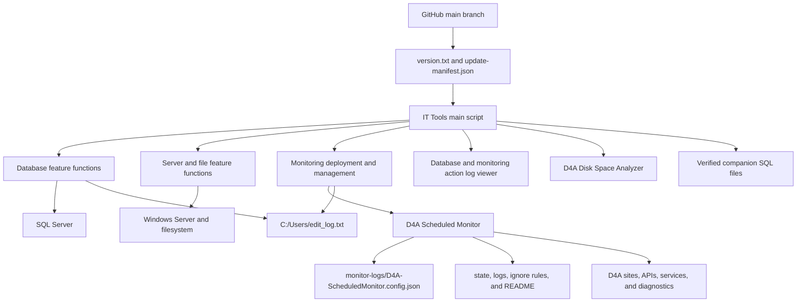
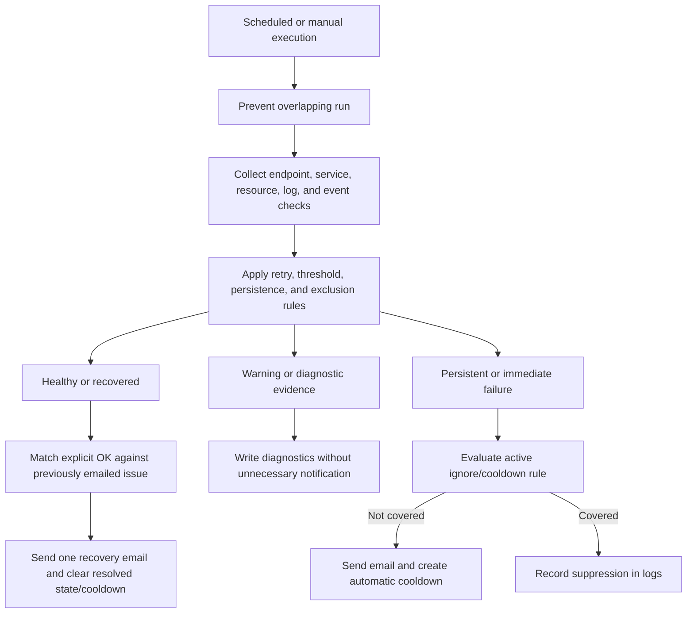
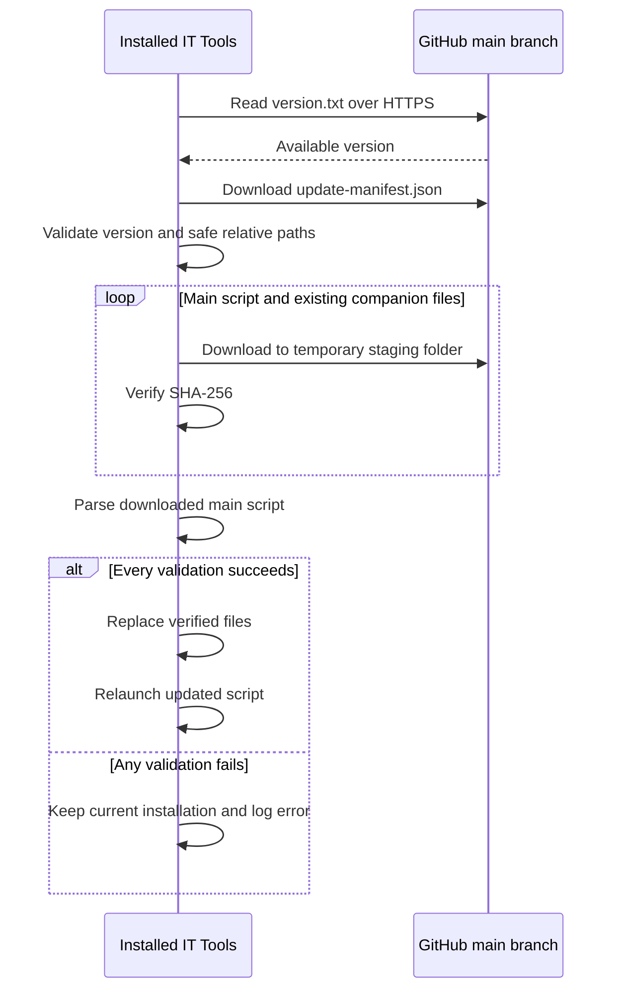

# Technical Design and Engineering

## Purpose and audience

This document explains how the toolkit works and why it was designed this way. It is intended for technical leads, senior support engineers, system administrators, developers, and reviewers evaluating implementation quality.

## Architecture overview

The repository contains a central interactive script and focused companion artifacts. The main script owns navigation, shared safety behavior, SQL connectivity, logging, and orchestration. Specialized scripts retain independent execution paths so they can also be improved and tested separately.



## Component map

| Component | Responsibility |
|---|---|
| `IT_Tools_Database_Translations_and_Server_Checks.ps1` | Main menus, input collection, shared helpers, database workflows, intervention audit, server tools, monitor deployment, and updates |
| `D4A-ScheduledMonitor-v5.ps1` | Unattended checks, autonomous verified updates, stateful alert evaluation, email delivery, logs, retention, and monitor management commands |
| `D4A-DiskSpaceAnalyzer.ps1` | Stand-alone or delegated disk scanning and visual reporting |
| `Find-LogGaps.ps1` | Stand-alone log timestamp-gap analysis with read sharing |
| Companion SQL files | Site-standard configuration data executed only by their selected feature |
| `CHANGELOG.md` | Human-readable record of significant releases, features, and production corrections |
| `IT_Tools_Script_Maintenance_Conditions.md` | Standing engineering constraints applied whenever the main script is changed |
| `version.txt` | Public main-tool version used by update checks |
| `update-manifest.json` | Allowlist and SHA-256 integrity values for distributed files |

At release 7.1.6, the main script contains approximately 9,500 lines and 245 PowerShell functions. The monitor contains approximately 4,200 lines and 97 functions. These counts describe implementation scope, not business impact.

## Main script architecture

The main script is organized around shared services and feature suites:

1. Startup initializes shared state, checks the release version, and invokes the automatic updater when needed.
2. Shared helpers provide navigation, logging, progress, timeouts, password input, SQL access, validation, backup creation, and result formatting.
3. The main menu routes to Database Tools, Local server and file tools, Site Monitoring, or Logs.
4. Feature functions collect and validate inputs before invoking SQL, filesystem, service, or child-script operations.
5. Exceptions are caught at feature boundaries and written to a daily log before control returns to the menu.

```mermaid
flowchart LR
    Input["User input"] --> Validate["Validate path, identifier, value, and permission"]
    Validate --> Preview["Show target and preview"]
    Preview --> Confirm["Typed confirmation for material changes"]
    Confirm --> Backup["Timestamped backup when data changes"]
    Backup --> Execute["Transaction or bounded operation"]
    Execute --> Verify["Counts, rows, or readable results"]
    Verify --> Log["Success output or daily error log"]
```



## Database connection design

Database features share one selected SQL Server instance, database, username, and password during a session. Password entry uses a custom console reader so paste operations work without displaying the value.

The `SqlServer` PowerShell module supplies `Invoke-Sqlcmd`. If it is absent, the tool offers a current-user installation and displays persistent progress while PowerShellGet and NuGet complete. SQL connections tolerate environments with untrusted internal certificates by requesting optional encryption and trusting the server certificate where the installed command supports those parameters. Direct `System.Data.SqlClient` connections use the same compatibility intent.

The connection layer centralizes conversion of PowerShell output to required strings. This was introduced after SQL connection builders received wrapped `PSObject` values instead of strings during translation import.

## Database safety model

### Identifier and object validation

User-entered table and column names are checked for safe SQL identifier syntax and verified against database metadata. New import table names are rejected if the table already exists. User text is encoded as Unicode SQL literals or passed through controlled query construction.

### Backups

Every feature that modifies an existing database table is expected to call the shared backup helper first. Backup names use the exact source table name followed by `yyyyMMddHHmmss`, for example:

```text
LanguageTranslations20260812143015
```

This naming convention lets the global rollback feature discover backups, group them by source table, show the creating feature, and restore a selected timestamp. A safety backup of the current target is created before restoration.

### Preview and confirmation

Broad or destructive workflows show the target and a sample or diagnostic preview, then require a typed action such as `IMPORT`, `MIGRATE`, `COMMIT`, `DELETE`, `RESTORE`, or `ROLLBACK`. A mismatched response cancels the change.

### Operator intervention audit

The shared SQL execution boundaries classify persistent database-write statements separately from read-only queries and writes limited to temporary tables or table variables. Immediately before the first persistent write in an action, the tool verifies that `C:\Users\edit_log.txt` is writable and requires the operator's full name. If the audit file cannot be opened, the database change is blocked.

One line is appended when the action completes. It contains the intervention timestamp, operator, menu/action context, selected non-sensitive variables, and `Success` or `Failed` with a concise reason. Passwords, credentials, connection strings, tokens, full SQL text, and other secrets are excluded. Confirmed monitoring creation and configuration changes use the same structure with the current Windows identity: creation captures hostnames, schedule frequency, and daily-monitoring status, while updates capture newly added hostnames and notification addresses. The fourth main menu exposes the ten newest entries without changing the file.

### Transactions and data rules

Multi-step writes use transactions where practical. Translation import skips blank translated values, updates existing target-language rows, inserts missing rows only when the RootId exists, and handles duplicate source identifiers without creating duplicate language keys.

### Rollback

Rollback is not implemented as a feature-specific afterthought. Timestamped backups form a shared recovery protocol. The rollback menu queries database metadata for names matching the convention and restores the selected table after a new safety backup.

## Database feature design

### Translation workflow

The translation workflow covers extraction, external translation, staging, preview, and migration:

```mermaid
flowchart LR
    Languages["Select existing or new language"] --> Scope["Export all content or only missing translations"]
    Scope --> CSV["CSV language file"]
    CSV --> Translate["External translation process"]
    Translate --> Import["Validate CSV columns and rows"]
    Import --> Stage["Create timestamped staging table"]
    Stage --> Preview["Preview updates and inserts"]
    Preview --> Backup["Back up LanguageTranslations"]
    Backup --> Commit["Update and insert non-empty translations"]
```



Column matching is case-insensitive, apostrophes and Unicode text are handled, invalid RootIds are skipped, and duplicate CSV RootIds are collapsed using the last non-empty translation. SQL identity behavior is detected rather than assumed.

### Generic import and migration

CSV files are read natively. XLSX files use the `ImportExcel` module, which can be installed for the current user on demand. Imported headers define a new staging table; overwriting an existing table is prohibited. An optional migration then validates source and destination tables and columns, previews the condition, backs up the destination, and applies the requested update.

### Diagnostics and search

Database-wide searches are read-only and have finite command timeouts. Text search calculates database size first and can exclude large tables. Performance tools inspect table space, SQL error logs, active requests, cached query statistics, resource-consuming statements, and ring-buffer CPU history. Long SQL text is abbreviated for the initial display and can be expanded by row.

## Server and file design

Potentially slow CIM, directory, and file operations use finite timeout wrappers. Results are returned to the existing console instead of closing the session.

The Data Collector event tracer locates log folders through the detected D4A installation or service executable, opens active files with `FileShare.ReadWrite`, filters by date and time window, applies a required search term, and supports up to three exclusion terms.

The disk analyzer remains a separate script. In elevated MFT mode it enumerates local NTFS metadata through native APIs, then reads sizes in parallel and builds visual output. Auto mode falls back to normal traversal when MFT access is unavailable. Keeping this component separate allows independent performance work without expanding the main script further.

## Monitoring architecture

### Deployment

IT Tools locates the D4A Configuration folder from Windows service metadata or accepts an explicit folder. Before creating monitor files, it resolves Node.js/npm through the command path, standard installation folders, environment variables, and registry data. If absent, an administrator can approve installation of the official Node.js LTS WinGet package with persistent progress. The tool then installs nodemailer, copies and unblocks the monitor, creates the external JSON configuration under `monitor-logs`, and can register silent recurring and daily-summary Scheduled Tasks under `SYSTEM`.

The configuration records the absolute `node.exe` and nodemailer paths so tasks running as `SYSTEM` do not depend on the interactive user's `PATH`. npm executes in a background job, but informational stderr such as `npm notice` is treated as output rather than a PowerShell failure; the native npm exit code determines success. A prior deployment that stopped before scheduling can be identified from the matching template hash, valid JSON, and absence of related Scheduled Tasks, whether nodemailer is still missing or completed before an earlier false failure. The operator can safely resume that deployment; its configuration is backed up before the runtime paths are repaired.

Each frontend site has a friendly display name. The corresponding API health endpoint is derived automatically. Multiple site addresses and names remain aligned in configuration.

### Configuration precedence

```text
Command-line parameter > JSON configuration > built-in default
```

Site-specific values are stored in:

```text
monitor-logs\D4A-ScheduledMonitor.config.json
```

This file contains sites, friendly names, recipients, paths, thresholds, and schedule metadata. It is intentionally excluded from releases. Monitoring version updates preserve the installed filename and back up the script, configuration, and Scheduled Task definitions before replacing code.

### Check pipeline



### False-positive reduction

Monitoring logic was refined using observed production alerts:

- frontend and API latency above 4,500 ms is logged but does not alert; only unreachability can alert;
- API probes retry before failure;
- CPU and memory require two consecutive runs at or above 90 percent before email notification;
- Data Collector service state is checked before interpreting SQL health evidence;
- a running Data Collector does not alert on one SQL timeout; persistent failures and LastHealthy age drive severity;
- Nginx requires more than 20 matching errors per minute for two consecutive minutes;
- known harmless NSSM output-rotation and ended-pipe events are excluded;
- relevant Windows events are retained as log-only evidence because service state is checked independently;
- disk capacity has no warning email and becomes critical at 5 GB free or less, or 95 percent used or more;
- Watchdog logs provide root-cause evidence but the monitor never restarts services;
- automatic issue cooldowns prevent repeated notification, and successfully emailed issues remain in state until the same check explicitly reports `OK` and a recovery email is delivered.

### Monitoring files and lifecycle

The monitor keeps daily `run_log_yyyyMMdd.txt` and `error_log_yyyyMMdd.txt` files, a single active `ignore-rules.txt`, a state JSON file for consecutive-run decisions, a configuration JSON file, and a locally generated README. Dated logs retain the current day and prior four days by default. Ignore rules rotate on the 3rd, 13th, and 23rd, retain the three newest archives, and carry active rules into the new file. Verified monitor-update backups are stored below `monitor-update-backups`.

## Logging and error handling

The main tool writes full error records to:

```text
Logs\tools_script_error_log_yyyyMMdd.txt
```

The entry includes timestamp, context, selected SQL server/database when relevant, exception type, category, invocation, script stack, and exception details. Short messages are displayed directly; long messages are abbreviated and point the user to the log.

Database-change and monitoring-change accountability is kept separately in `C:\Users\edit_log.txt`. This concise audit file records successful and failed database writes, monitor deployments, and monitoring configuration updates and is readable through **Logs > Last Actions done by this script**.

Long operations use persistent timestamped progress lines with percentage, step, and description. This avoids the transient behavior of `Write-Progress` and makes module installation, imports, backups, searches, and deployment understandable in remote support sessions.

## Automatic update design



The updater always includes the main script and refreshes companion files only when they already exist locally. If an official companion is missing, the selected feature downloads only that file, validates it against the manifest, and then saves it beside IT Tools. Before a monitoring deployment or version comparison, IT Tools also retrieves the current official monitor with cache-busting, verifies its manifest hash and parser result, and refreshes an outdated local template. Consequently, a stale companion can never make **Update monitoring script version** report that an older installed version is current. Site configuration, credentials, monitoring state, logs, and ignore rules are never release payloads.

The monitoring script independently performs the same cache-bypassed release check on every execution unless `-SkipAutomaticUpdate` is supplied. It validates the manifest entry, SHA-256, monitor version and release-date headers, PowerShell syntax, and compatibility with the current JSON configuration. A file lock prevents recurring and daily Scheduled Tasks from racing to update the same deployment. Before replacing its own installed path, it backs up the current script, external JSON configuration, and matching Scheduled Task definitions. The installed filename and task settings remain unchanged, version metadata is written back to the JSON, and the verified code starts on the next execution. Update failure restores both the script and configuration, is logged, and does not prevent the health check from continuing.

`CHANGELOG.md` complements this mechanism but is not an updater input. It explains meaningful changes to technicians and reviewers, while `version.txt` determines whether an update exists and `update-manifest.json` defines and verifies the downloadable release payload.

## Maintainability rules

Standing maintenance conditions require every enhancement to preserve common behavior:

- database backups before editing data;
- exact timestamp naming for rollback discovery;
- `q` at visible prompts;
- progress for long-running work;
- full daily error logs;
- operator attribution and concise database-intervention or monitoring-change results in `C:\Users\edit_log.txt`;
- finite timeouts for deep scans and heavy system queries;
- safe SQL identifier handling;
- syntax validation before publication;
- synchronized release version and manifest hashes;
- preservation of local monitoring configuration during updates.
- autonomous verified monitor update checks that fail safely without stopping health monitoring.

These rules convert lessons from earlier defects into constraints for future features.

## Testing and release validation

Current release validation is pragmatic rather than a formal automated test suite:

- PowerShell parser validation for the main and monitoring scripts;
- SHA-256 comparison for every manifest file;
- manifest/version consistency checks;
- `git diff --check` before release;
- functional execution of affected menu paths and failure scenarios during development;
- database previews, transactions, row counts, and post-change verification in workflows;
- production feedback used to reproduce and correct environment-specific failures.

The next maturity step is automated tests for pure helper functions, SQL generators, configuration conversion, file selection, and monitoring state transitions.

## Key engineering decisions

| Decision | Reason |
|---|---|
| Central menu-driven toolkit | Standardize discovery and interaction across workflows |
| Shared safety helpers | Prevent each feature from implementing backup, validation, and error handling differently |
| External monitor configuration | Update code without overwriting site-specific settings |
| Timestamped table backups | Provide a discoverable recovery protocol across database features |
| Typed confirmations | Reduce accidental execution of broad or destructive changes |
| GitHub as release source | Maintain one versioned source of truth |
| SHA-256 manifest | Reject incomplete, corrupted, or unexpected release content |
| Parse before replace | Prevent distribution of a syntactically invalid main script |
| On-demand companion download | Avoid unnecessary files while preserving feature usability |
| Persistent progress output | Make long operations visible in normal and remote consoles |
| Stateful alert thresholds | Distinguish transient degradation from persistent failure |
| Separate disk analyzer | Preserve independent execution and performance-focused evolution |

## Known constraints

- The main script is large; future modularization would improve isolated testing and review.
- SQL behavior and permissions vary by customer environment, so live change validation still requires an authorized technician.
- Some diagnostics depend on SQL Server DMV or error-log permissions.
- XLSX import requires the third-party `ImportExcel` module.
- Email deployment uses Node.js and nodemailer unless SMTP fallback is explicitly configured.
- MFT disk scanning requires local NTFS access and usually elevation.
- HTTPS plus SHA-256 validates release integrity against the manifest but is not equivalent to signed releases.

## Repository structure

```text
IT_Tools_DB_Management_Server_Tools/
|-- README.md
|-- CHANGELOG.md
|-- docs/
|   |-- 01-project-overview.md
|   |-- 02-technical-design.md
|   `-- 03-user-guide.md
|-- IT_Tools_Database_Translations_and_Server_Checks.ps1
|-- D4A-ScheduledMonitor-v5.ps1
|-- D4A-DiskSpaceAnalyzer.ps1
|-- Find-LogGaps.ps1
|-- AssemblyRules_Luleburgas.sql
|-- RoleAdminLuleburgaz-DanoneStandard-090426.sql
|-- update-manifest.json
`-- version.txt
```
